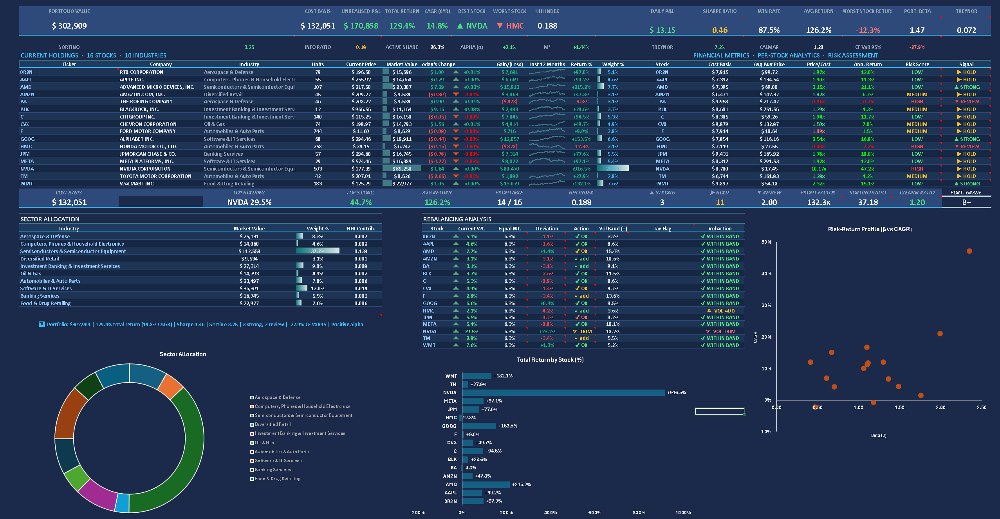

# Stock Portfolio Tracker & Analytics Engine

**A comprehensive Excel‑based financial analytics platform for multi‑asset portfolio management**

This project is a professional‑grade stock portfolio tracking system built entirely in Microsoft Excel. It integrates live market data, advanced Excel formulas (dynamic arrays, `STOCKHISTORY`, linked data types), and CFA‑level risk analytics to provide real‑time portfolio monitoring, risk decomposition, factor exposure, and performance reporting.

---

## Key Features

- **Live Portfolio Dashboard** – KPI cards, daily P&L, sparkline trends, and real‑time stock prices via Excel’s Stocks data type.
- **Transaction Ledger** – 112 buy/sell records across 16 stocks over 7 years, automatically feeding all analytics.
- **Advanced Financial Metrics** – CAGR, total return, unrealised gains/losses, sector concentration (HHI Index), and risk flags.
- **Automated Allocation** – $10,000 annual investment with sector caps (Tech max 35%) and systematic rebalancing.
- **Comprehensive Risk Analytics** – CAPM, Jensen’s Alpha, Beta, Sharpe & Treynor ratios, Sortino ratio, Calmar ratio, Value‑at‑Risk (parametric/historical/Monte Carlo), Expected Shortfall (CVaR), M² measure, and factor exposure (growth/value tilt).
- **Watchlist Scoring Model** – Multi‑factor ranking (P/E, Beta, 52‑week range) with composite scores and buy/watch/avoid signals.
- **Automated Validation Suite** – 16+ CFA‑grade integrity tests (weight summation, HHI consistency, cross‑sheet checks) with real‑time pass/fail status.
- **Dynamic Data Integration** – Uses Excel’s `STOCKHISTORY` for price series, linked data types for live market data, and dynamic arrays (`SORT`, `UNIQUE`, `FILTER`) for automatic data propagation.

---

## Skills Demonstrated

| Category | Skills |
|----------|--------|
| **Financial Modelling** | Portfolio construction, P&L tracking, CAGR analysis, risk‑adjusted metrics, sector allocation, CAPM, VaR, factor decomposition |
| **Risk Analysis** | HHI concentration index, drawdown analysis, position sizing, diversification metrics, beta decomposition, downside deviation, CVaR |
| **Data Engineering** | Dynamic arrays, linked data types, structured references, cross‑sheet data pipelines, `STOCKHISTORY` for historical series |
| **Dashboard Design** | KPI cards, conditional formatting, sparklines, interactive charts, professional colour themes, icon‑based alerts (🔻 TRIM / 🔺 ADD) |
| **Data Visualisation** | Pie charts, bar charts, sparklines, colour‑coded tables, trend analysis, 52‑week range heatmaps |
| **Quality Assurance** | Automated validation framework, consistency checks, reasonableness tests, CFA‑grade audit framework |
| **Domain Knowledge** | GICS sector classification, stock market mechanics, Buy/Sell transaction modelling, CAPM equilibrium, factor tilts |

---

## Workbook Structure

| Sheet Name | Description |
|------------|-------------|
| **README** | Project overview, structure, and usage instructions. |
| **Dashboard** | Main portfolio view – live stock prices, market values, daily P&L, sparkline charts, KPI summary cards, sector allocation, rebalancing analysis. |
| **Analytics** | Deeper metrics: per‑stock returns, CAGR, sector concentration (HHI Index), risk flags, allocation charts, portfolio health scorecard. |
| **Risk Analytics** | CFA‑level quantitative risk decomposition – CAPM, beta, alpha, Sharpe/Treynor/Sortino ratios, VaR (parametric), CVaR, M², Calmar, factor exposure (growth/value tilt), capital market line analysis. |
| **WL Dashboard** | Watchlist scoring model – multi‑factor ranking (P/E, Beta, 52‑week range %) with composite scores, buy/watch/avoid signals, momentum indicators. |
| **Watchlist** | Competitor analysis – 10 rival stocks with live data, 52‑week ranges, beta, P/E, market cap, industry. |
| **Ledger** | Complete transaction history – 112 records over 7 years with date, stock, type, price, units, amount. |
| **Sparkline** | Price history data feeding dashboard sparkline trend visualizations. |
| **Validation** | Automated integrity tests – 16+ CFA‑grade checks (weights, HHI consistency, risk metric reasonableness, cross‑sheet consistency). |
| **Stock Sheets** | Individual stock deep‑dives with `STOCKHISTORY` price series and charts (AMD, BABA, BAC, COST, DELL, XOM, GM, LMT, MSFT, GS). |

---

## How to Use

1. **Enable Data Types** – Ensure Excel is connected to the internet. The Stocks linked data types require a Microsoft 365 subscription.
2. **Review Dashboard** – The Dashboard auto‑updates with live prices. Check KPI cards for portfolio summary, stock table for details, and sector breakdown below.
3. **Explore Analytics** – The Analytics sheet provides per‑stock returns, sector HHI, risk flags, and allocation charts.
4. **Run Risk Analytics** – The Risk Analytics sheet offers CAPM decomposition, VaR estimates, factor exposures, and portfolio efficiency metrics.
5. **Monitor Watchlist** – Track competitor stocks with live data. The WL Dashboard scores each stock and generates buy/watch/avoid signals.
6. **Validate Model** – The Validation sheet runs 16+ automated tests to ensure data integrity and cross‑sheet consistency. All tests should show “PASS”.
7. **Add Transactions** – Add new rows to the Ledger table. All Dashboard, Analytics, and Risk Analytics formulas auto‑update via structured references.

---

## Dashboard Preview

The dashboard includes:
- **Portfolio Value** – total market value, cost basis, unrealised P&L, total return, and 7‑year CAGR.
- **Holdings Table** – live prices, daily change, gain/loss, weight, return %, risk score, and trade signal (▲ STRONG / ▶ HOLD / ▼ REVIEW).
- **Sector Allocation** – market value by industry with HHI contributions to quantify concentration risk.
- **Rebalancing Analysis** – current weight vs. equal weight, deviation, and suggested action (🔻 TRIM / 🔺 ADD / ✔ OK).
- **Risk Metrics** – Sharpe ratio, win rate, max drawdown, portfolio beta, Treynor ratio, profit factor, Sortino ratio, Calmar ratio, and overall portfolio grade.

---

## Advanced Techniques Used

- **Dynamic Arrays** – `SORT`, `UNIQUE`, `FILTER`, `SORTBY` with spill ranges for automatic data propagation.
- **Linked Data Types** – Excel Stocks data type with dot notation for real‑time market data integration.
- **STOCKHISTORY** – Historical price series retrieval for sparklines and stock analysis sheets.
- **SUMIF / COUNTIF** – Cross‑sheet aggregation for transaction totals and sector‑level rollups from the Ledger.
- **INDEX / MATCH** – Best and worst performer identification with dynamic lookups across spill ranges.
- **CAGR Formula** – Annualised return: `(Ending Value / Beginning Value) ^ (1 / Years) - 1`.
- **HHI Index** – Sum of squared sector weights to quantify portfolio concentration risk.
- **CAPM & Alpha** – `E(Rp) = Rf + βp(Rm‑Rf)` and Jensen’s Alpha for performance attribution.
- **Value‑at‑Risk (VaR)** – Parametric VaR (95% & 99%), Expected Shortfall (CVaR), downside deviation.
- **Risk‑Adjusted Ratios** – Sharpe, Treynor, Sortino, Calmar, M², Information Ratio.
- **Factor Exposure** – Growth/value tilt identification, weighted average beta, active share proxy.
- **Conditional Formatting** – Automated colour coding for negative/positive values with emoji risk indicators.
- **Allocation Model** – Weighted allocation with sector caps (Tech max 35%) and systematic Buy/Sell rules.
- **Validation Framework** – 16+ automated tests including weight summation, HHI consistency, CAPM identity, cross‑sheet metric alignment, and reasonableness checks.

---

## Built With

- **Microsoft Excel 365** – Dynamic Arrays, Stocks Data Type, Advanced Formulas
- **Data Sources** – Excel Linked Data Types (Stocks), `STOCKHISTORY` function, historical closing prices from Nasdaq/Yahoo Finance

---

## License & Acknowledgements

This project was developed as a personal portfolio piece to demonstrate proficiency in financial analytics, data engineering, dashboard design, and quantitative risk modelling. It is provided “as is” for educational purposes.

Feel free to use, modify, and share it for non‑commercial purposes. For any questions or suggestions, please open an issue in this repository.

---

**Author:** Alven Yuka  
**Version:** 1.0  
**Last Updated:** 25th March 2026
