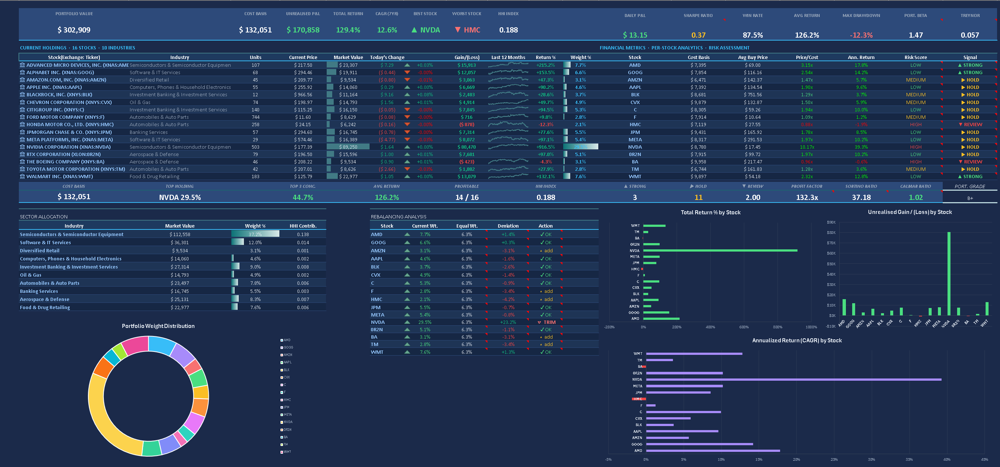
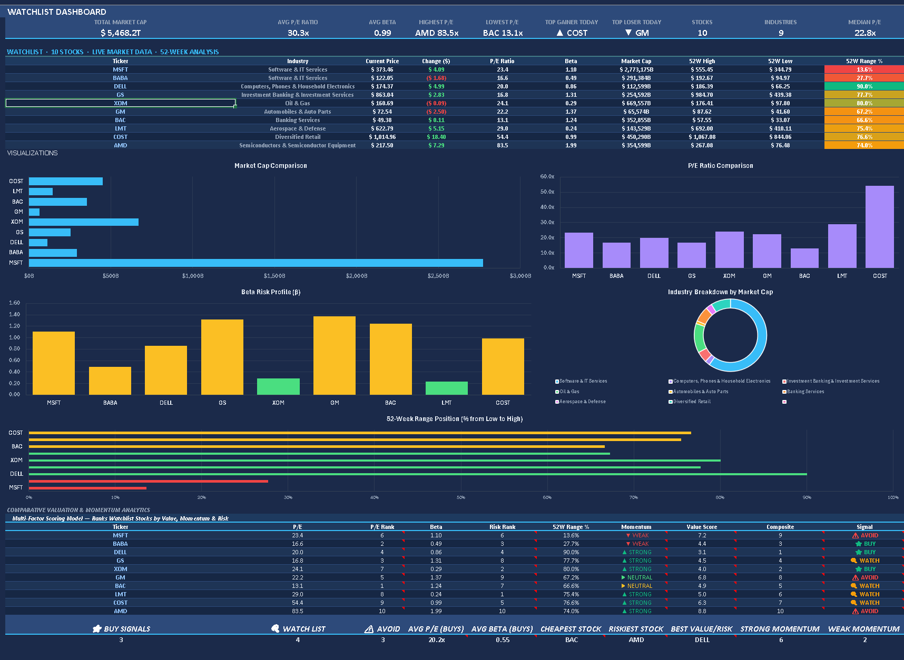

# Stock Portfolio Tracker & Analytics Engine

**An institutional-grade Excel-based portfolio analytics platform — 16 stocks · 10 industries · 7 years · CFA Level I–III methodology**

---

## Dashboard Preview

### Main Portfolio Dashboard

### Watchlist & Competitor Analysis

---

## Project Overview

This workbook is a production-quality stock portfolio analytics system built entirely in **Microsoft Excel 365**. It demonstrates mastery of quantitative finance, risk management, and portfolio optimization — spanning CFA Level I–III curriculum concepts from CAPM and factor attribution through to Black-Litterman optimization, Cornish-Fisher VaR, and tax-aware rebalancing.

| Metric | Value |
|---|---|
| **Portfolio Value** | $303,680 |
| **Cost Basis** | $132,051 |
| **Total Return** | 129.97% |
| **7-Year CAGR** | 14.89% |
| **Sharpe Ratio** | 0.47 |
| **Sortino Ratio** | 3.10 |
| **Portfolio Beta** | 1.47 |
| **Portfolio Grade** | B+ |

---

## Key Features

- **Live Portfolio Dashboard** — KPI cards, daily P&L, sparkline trends, and real-time stock prices via Excel Stocks linked data type
- **Transaction Ledger** — 112 buy/sell records across 16 stocks over 7 years, feeding all analytics automatically
- **Advanced Financial Metrics** — CAGR, total return, unrealised gains/losses, sector concentration (HHI Index), and risk flags
- **Automated Allocation** — $10,000 annual investment with sector caps (Tech max 35%) and systematic rebalancing
- **Comprehensive Risk Analytics** — CAPM, Jensen's Alpha, Beta, Sharpe/Treynor/Sortino/Calmar ratios, VaR (parametric/historical/Monte Carlo), CVaR, and factor exposure
- **Watchlist Scoring Model** — Multi-factor ranking (P/E, Beta, 52-week range) with composite scores and buy/watch/avoid signals
- **Black-Litterman Optimization** — Bayesian framework combining market equilibrium priors with investor views and optimal weights
- **Automated Validation Suite** — 23 integrity tests with real-time pass/fail status
- **Tax-Aware Ledger** — MAXIFS lot matching, ST/LT classification per IRS Section 1222
- **Dynamic Data Integration** — STOCKHISTORY, linked data types, dynamic arrays (SORT, UNIQUE, FILTER)

---

## Workbook Structure

| Sheet | Description |
|---|---|
| **Dashboard** | Primary view — dual-row KPI strip, live 16-stock table, sector allocation, volatility-scaled rebalancing, 3 embedded charts |
| **Analytics** | Per-stock CAGR, return attribution, cost basis breakdown, risk scores |
| **Risk Analytics** | CAPM, VaR, CVaR, drawdown analysis, stress testing, factor exposure, Capital Market Line |
| **WL Dashboard** | Watchlist scoring model with composite signals |
| **Watchlist** | 10 competitor stocks with live data, 52-week ranges, beta, P/E, market cap |
| **Optimization** | Black-Litterman optimization with investor view panel and BUY/SELL/HOLD trade list |
| **Ledger** | 112 transaction records with holding period and LT/ST tax status |
| **Validation** | 23 automated CFA-grade integrity tests — all PASS |
| **Skills Matrix** | 30 quantitative finance skills mapped to CFA Level I-III |
| **Sparkline** | Price history for dashboard sparklines |
| **Stock Sheets** | Individual deep-dives: AMD, BABA, BAC, COST, DELL, XOM, GM, LMT, MSFT, GS |

---

## How to Use

1. Open in **Microsoft Excel 365** with an internet connection
2. Click **Data > Refresh All** to pull live prices, beta, P/E, and market cap
3. Review the Dashboard for portfolio summary and KPI cards
4. Add new transactions to the Ledger — all sheets auto-update
5. Enter investor views in the Optimization sheet for Black-Litterman weights
6. Check Validation sheet — all 23 tests should show PASS

---

## Built With

**Microsoft Excel 365** — Dynamic Arrays, Stocks Data Type, STOCKHISTORY, Advanced Formulas. No VBA, no macros.

---

## License

MIT — provided for educational and portfolio demonstration purposes.

**Author:** Alven Yuka | **Version:** 2.0 | **Updated:** April 2026
