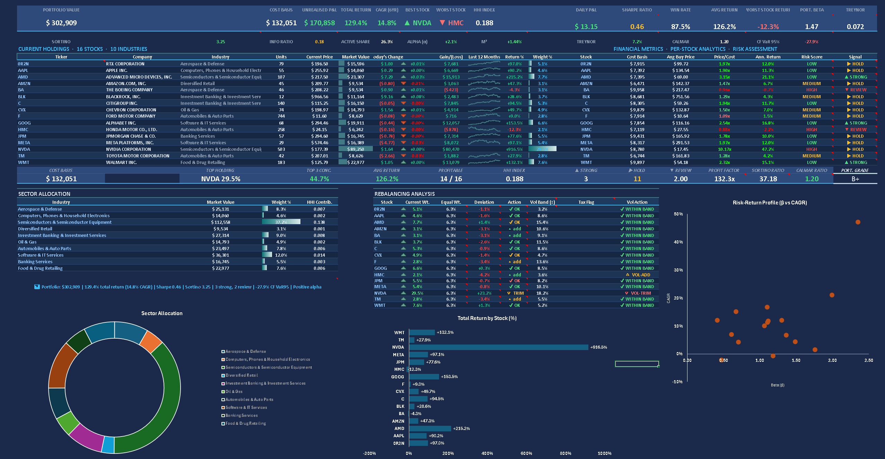

# Stock-Portfolio-Tracker-Analytics-Engine

> Excel 365 workbook tracking a 16-stock paper portfolio: live prices via `STOCKHISTORY`, CAPM and parametric VaR, concentration analysis, a watchlist scorer, and a Python validator that recomputes every published figure outside the spreadsheet. No VBA, no macros, no add-ins.

[](LICENSE)
[](https://www.microsoft.com/en-us/microsoft-365/excel)
[](#validation-harness)
[](https://github.com/alvenyuka/Stock-Portfolio-Tracker-Analytics-Engine/actions/workflows/ci.yml)


## Read this before the numbers

**The workbook adds sell transactions to positions instead of netting them, so
every performance figure below is wrong.** `Dashboard!D7` computes units held as
`SUMIF(Ledger[Stock], ..., Ledger[Units])`, and all 32 sell rows in the ledger
carry positive units and a positive transaction amount, exactly like the 80 buy
rows. A sale therefore increases the position and increases the cost basis.
Across the ledger that is 2,441.55 gross units against 1,008.21 net of sales.
Market value, cost basis, weights, per-holding returns, CAGR, beta, and every
risk ratio on the Risk Analytics sheet are computed from those units and inherit
it.

This is stated here rather than quietly corrected because fixing it rewrites
every published performance number in the repo, and that is a decision to take
deliberately. `python validate_portfolio.py` reports it, with the measured
numbers, on every run. Three further defects are reported alongside it and
described under [Known Limitations](#known-limitations).

Everything below the Portfolio Snapshot heading should be read with that in
mind. The mechanics, the validator and the test suite are unaffected by it; the
performance figures are not.

## Why?

I wanted to know what my paper portfolio's risk profile looked like, not just
its return, and to build the pieces rather than buy them: CAPM decomposition,
value at risk, concentration measures and a watchlist scorer, all in one
self-contained Excel 365 file with live prices via `STOCKHISTORY` and dynamic
arrays, and then a separate Python script that recomputes the output without
trusting a single cell of it.

> **Note: this is a paper portfolio.** The transactions are hypothetical, picked
> for the project rather than executed through a brokerage account. Every metric
> in this workbook is derived from that hypothetical ledger.

## Project Structure

```
Stock-Portfolio-Tracker-Analytics-Engine/
├── Stock Portfolio.xlsx          # Main workbook, all analytics in one file
├── MainDashboard.png             # Dashboard screenshot
├── StockDashboard.png            # Stock-level deep-dive screenshot
├── WatchlistDashboard.png        # Watchlist scoring screenshot
├── validate_portfolio.py         # Recomputes every figure outside the spreadsheet
├── tests/
│   ├── test_validate_portfolio.py  # Breaks a copy, checks each fault is caught
│   └── xlsx_surgery.py             # Edits one cached cell without losing the rest
├── .github/workflows/ci.yml      # Runs both on every push
├── requirements.txt              # openpyxl and pytest, for the validator only
├── LICENSE
└── README.md
```

## Quick Start

1. Clone the repo and open `Stock Portfolio.xlsx` in **Microsoft Excel 365**
2. **You will likely see `#VALUE!` errors on first open, this is expected**, on every sheet with a live-price dependency (Dashboard, Watchlist, Ledger, Spartkine, and each individual stock tab). Excel's Stocks data type and `STOCKHISTORY` results are tied to a live cloud connection that doesn't survive a file transfer (clone, zip, or copy to a new machine). Run **Data → Refresh All** to reconnect and repopulate them.
3. Check the **Validation** tab: all 23 tests must read `PASS`. They test internal consistency, for example Dashboard totals matching Analytics totals, and remain valid even before you refresh live prices, since they were captured at the last successful refresh. They do not test whether a formula computes what its label says, which is how the ledger-netting defect above passes all 23.
4. Explore the Dashboard, Analytics and Risk Analytics sheets.

> Requires Excel 365 with an internet connection. The Stocks data type and `STOCKHISTORY` function are not available in older Excel versions or Google Sheets.

## Features

- **Performance attribution**: per-stock CAGR, return decomposition, unrealised P&L, sector concentration (Herfindahl-Hirschman Index), effective position count, an active-share proxy against equal weight
- **CAPM decomposition**: portfolio beta as a weighted average of holding betas, expected return, Jensen's alpha, Treynor ratio, a Capital Market Line comparison and M-squared
- **Parametric VaR**: 95% and 99% one-year value at risk and a 95% expected shortfall, from a normal quantile on a beta-implied volatility. Three cells, and only the parametric form, see Known Limitations
- **Watchlist scoring**: 10 competitor stocks ranked through a composite signal (P/E, beta, 52-week range) into buy / watch / avoid
- **23 automated integrity checks** on the Validation tab, all required `PASS` before the dashboard renders, plus **28 figures re-derived independently in Python** by `validate_portfolio.py`
- **Live data** via the Excel Stocks data type and `STOCKHISTORY`, no VBA, no macros, no add-ins

### What is not in the workbook

An earlier version of this README advertised historical and Monte Carlo VaR, a
Cornish-Fisher heavy-tail adjustment, Black-Litterman optimisation with a trade
list, tax-aware lot matching under IRS section 1222, and a drawdown and stress
panel. None of those is in the file. There is no Optimization sheet, no lot
identifier or cost-basis method anywhere in the ledger, no `MAXIFS`, and no
stress scenarios. The claims are removed rather than reworded. What the VaR
block does contain is three parametric cells, and what the drawdown row contains
is the worst single holding's return.

## Tech Stack

| Layer | Tools |
|---|---|
| Spreadsheet | Microsoft Excel 365 |
| Live data | `STOCKHISTORY`, Stocks data type, dynamic arrays |
| Math | Native Excel functions only, no VBA, no macros, no add-ins |
| Validator | Python, openpyxl, pytest |

## Sheet Structure

### Core analytics

| Sheet | Purpose |
|---|---|
| **Dashboard** | KPI strip, live 16-stock table, sector allocation, rebalancing panel, embedded charts |
| **Analytics** | Per-stock CAGR, return attribution, cost-basis breakdown, risk scores |
| **Risk Analytics** | CAPM, parametric VaR and CVaR, the ratio block, a style-tilt panel, Capital Market Line |

### Watchlist

| Sheet | Purpose |
|---|---|
| **WL Dashboard** | Watchlist composite scoring with buy / watch / avoid signals |
| **Watchlist** | 10 competitor stocks with live data, 52-week ranges, beta, P/E, market cap |

### Data & validation

| Sheet | Purpose |
|---|---|
| **Ledger** | 112 transaction records: date, stock, buy or sell, price, units, amount, ticker |
| **Validation** | 23 automated integrity tests, all required `PASS` for dashboard render |
| **Spartkine** | Price history feeding the dashboard sparklines (the tab is spelled this way in the workbook) |
| **Stock Sheets** | Individual deep-dive tabs for 10 of the 16 holdings (AMD, BABA, BAC, COST, DELL, XOM, GM, LMT, MSFT, GS) |




## Validation Harness

A dedicated sheet runs 23 integrity tests across the workbook. Every test must
pass before the dashboard renders. They cover totals tying between sheets,
return formula consistency and inter-sheet references.

### Checking it without opening Excel

That sheet reports its own results, which is worth exactly what the formulas
behind it are worth. `validate_portfolio.py` is the outside opinion: it reads
only inputs, recomputes every derived figure in Python, and never reads a cell
containing a tick or a pass count.

```bash
pip install -r requirements.txt
python validate_portfolio.py                 # defaults to the workbook here
python validate_portfolio.py path/to/Book.xlsx
```

28 figures across three groups. **Portfolio accounting**: totals against the sum
of their parts, the profit identity, every holding's gain, return and weight, and
the portfolio CAGR against total return over the workbook's hardcoded seven-year
horizon. **Concentration**: the Herfindahl-Hirschman index against the sum of
squared sector weights, effective positions against the reciprocal of the
holding-level index, and the top-three weight. **CAPM and risk**: the equity risk
premium, the CAPM expected return, Jensen's alpha, the Treynor, Sharpe, Sortino
and Calmar ratios, and portfolio volatility against the workbook's hardcoded
0.155 market-volatility assumption. All 28 reconcile on the committed workbook,
and the script exits non-zero if any stops doing so.

**What those 28 do not tell you.** They ask whether the workbook computes what
its own formulas say. None of them can catch a figure that is computed correctly
and means something other than its label claims, and four such defects are
known. The script now prints all four, with measured numbers, under KNOWN DEFECT
on every run: the ledger netting described at the top of this README, a negative
tracking error carrying the information ratio's sign, a Calmar denominator that
is the worst holding's return rather than a drawdown, and a volatility estimate
containing no idiosyncratic risk. They are reported rather than failed, because
they are not arithmetic errors and because correcting them rewrites published
performance figures.

One of the 28 used to be untestable. It derived `beta * (volatility / beta)` and
compared it against volatility, which is the same cell either side of the
equals sign, so it passed for any volatility whatsoever, including 99.0. It now
asserts `volatility = beta x 0.155` and names the 0.155, which is the assumption
that was never checked.

**The validator is itself tested.** A script only ever run against a correct
workbook proves nothing: it would report everything as matching just as
confidently if its comparisons were inverted. So `tests/` copies the workbook,
changes one cached cell, and asserts that specific figure is reported as wrong.
Eleven tests cover a broken total, a single corrupted holding weight, a wrong
index, a broken CAPM return, a broken Sharpe ratio, and a cell holding a division
by zero. CI runs those first and the real workbook second.

One detail worth knowing if you extend the tests: openpyxl holds either formulas
or cached results, never both, so saving a workbook with it discards every cached
value and the validator then reads nothing. `tests/xlsx_surgery.py` edits the
cached value directly in the sheet XML instead, leaving the formula, the styles
and every other cell untouched.

## Portfolio Snapshot

These are the figures the committed workbook produces at its last `STOCKHISTORY`
refresh. **Every one of them is computed on gross rather than net units**, per
the notice at the top of this README, so treat them as a record of what the file
currently outputs rather than as the portfolio's performance. The right-hand
column says what each row actually measures, which in four cases is not what its
name suggests.

| Metric | Value | What it is |
|---|---|---|
| Portfolio value | $302,909.22 | Gross units x current price, not net of the 32 sales |
| Cost basis | $132,051.42 | Buys plus sells, not buys minus sale proceeds |
| Total return | 129.39% | Market value over cost basis, both as above |
| 7-year CAGR | 12.59% | A lump-sum equivalent on total cost basis, over a horizon hardcoded at 7 years for every holding. The ledger contributes capital every January from 2019 to 2025, so a money-weighted IRR would differ materially |
| Portfolio beta | 1.47 | Weighted average of holding betas, weights as above |
| Sharpe ratio | 0.37 | Excess CAGR over beta x 0.155, which is systematic volatility only and contains no idiosyncratic risk. Algebraically Treynor divided by 0.155 |
| Sortino ratio | 2.56 | Cross-sectional semi-deviation of the 16 holdings' since-inception returns, against a zero target, under an annualised numerator using a 4.25% risk-free rate. It is not a downside deviation of a return series over time |
| Max drawdown | -12.33% | The worst single holding's total return. The workbook's own row label for the same cell is "Max Individual Position Loss". It is not a peak-to-trough decline of portfolio value, and no such series exists in the file |
| Calmar ratio | 1.02 | CAGR divided by the row above, then scored against benchmark bands that belong to a real Calmar ratio |

The workbook also carries a self-assessed "portfolio grade" of B+. It is the
average of five sub-scores on a 2-to-10 scale, each set by thresholds the
workbook chooses for itself, on a sheet that
simultaneously marks Sharpe "Poor", alpha "Negative", the Capital Market Line
position "Suboptimal" and M-squared "Underperformance". It was on a badge at the
top of this README and has been removed: a grade a workbook awards itself is not
a result.

## Known Limitations

- **Sells are not netted.** See the notice at the top. This is the one that moves every number.
- **Paper portfolio.** Every metric here is derived from a hypothetical ledger, not executed trades.
- **The risk ratios are cross-sectional, not time series.** Sharpe, Sortino, Calmar and max drawdown are all computed across the 16 holdings' since-inception returns at one moment, not from a portfolio value path over time. The workbook pulls `STOCKHISTORY` per ticker, so a weighted daily return series is buildable and would let these be computed properly; it is not built. Until it is, the four names above are labels the quantities do not earn, which is why the table above says what each one measures.
- **Tracking error is negative, and the information ratio is positive because of it.** `Risk Analytics!C17` computes a standard deviation minus a return, which is dimensionally incoherent and comes out at -0.0298. The information ratio divides Jensen's alpha, which is also negative, by it and reports +0.042 with a verdict of "Marginal", on the same sheet that marks the alpha negative. Neither figure is quoted above. Computing a real tracking error needs a benchmark return series the workbook does not have.
- **"Max 1Y loss" is not what VaR means.** `Risk Analytics!E26` renders the 95% VaR as "Max 1Y loss: $75,612". A 95% VaR is the loss threshold exceeded 5% of the time; the expected loss given exceedance is the CVaR on the row below, and the maximum is unbounded. The same block substitutes a realised geometric CAGR into a normal-quantile formula that wants an arithmetic expected return, and uses the systematic-only volatility above, so the tail loss is understated for a concentrated 16-stock book.
- **The style-factor panel classifies by past return.** `Risk Analytics!J39:J54` labels a holding Growth, Blend, Value or Distressed from its cumulative return, so Amazon comes out "Value" on a 47% return and two holdings that are down come out "Distressed", which is a credit term for near-default. The summary string counts 14 of 16 holdings because the concatenation omits the "Distressed" bucket. Row 60 labels portfolio beta a "Size Factor"; nothing on the sheet measures size. The Roadmap below already says a real factor sheet is not built, and the panel should be read as a performance tercile, not as factor exposure.
- **"Effective # Positions (1/HHI)" is published twice with two different values**, 8.05 on Risk Analytics from holding weights and 5.32 on Analytics from sector weights, both under the same name and the same "10-20 ideal" band. They are effective holdings and effective sectors respectively.
- **Win/loss ratio and profit factor are trading-system statistics** applied cross-sectionally to 16 long-only positions, which is why the profit factor reads 132.3. They are on the Analytics sheet and are not quoted here.
- **No transaction costs, slippage, or bid-ask spread are modelled.** All fills are at historical closing prices.
- **Risk-adjusted figures are a single-point snapshot.** They are computed at the last `STOCKHISTORY` refresh and move every time the workbook is refreshed.

## Roadmap

- [x] CAPM decomposition, parametric VaR and CVaR
- [x] Concentration and active-share measures
- [x] 23-check in-sheet validation harness, plus an independent Python validator with its own tests
- [ ] Net sell transactions in the ledger and restate every figure downstream
- [ ] Build a weighted portfolio return series from `STOCKHISTORY` and compute real volatility, downside deviation and peak-to-trough drawdown from it
- [ ] Replace the CAGR with an XIRR over the ledger's dated cash flows
- [ ] Historical and Monte Carlo VaR, and a Cornish-Fisher adjustment
- [ ] Black-Litterman optimisation with investor views
- [ ] Tax-aware lot matching under IRS section 1222
- [ ] Factor model (Fama-French 3 / 5) sheet
- [ ] Scenario stress library (rates +200bp, oil shock, USD/KES devaluation)

## License

MIT. See [`LICENSE`](LICENSE).

## Credits

Built with **Microsoft Excel 365** only.
Author: **Alven Yuka**, CPA Finalist (Kenya).

Every figure in the Portfolio Snapshot above is read from the workbook and re-derived by `validate_portfolio.py`, not restated by hand. What that re-derivation does and does not establish is set out under Validation Harness.

## Connect

📫 [alvenyuka2@gmail.com](mailto:alvenyuka2@gmail.com) · 💼 [LinkedIn](https://www.linkedin.com/in/alven-yuka-610b78174/) · 🐙 [GitHub](https://github.com/alvenyuka)
