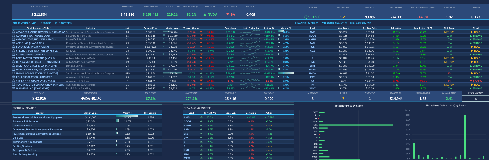
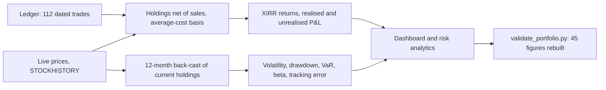

# Stock-Portfolio-Tracker-Analytics-Engine

An Excel 365 portfolio tracker for 16 listed stocks, built from a 112-trade ledger with live prices, CAPM
and 12-month risk analytics, and a Python validator that rebuilds all 45 derived figures from the raw inputs.
The portfolio returned **32.2% a year** since 2019 (money-weighted), with **45% of its value in NVIDIA**.

[](LICENSE)
[](https://www.microsoft.com/en-us/microsoft-365/excel)
[](https://github.com/alvenyuka/Stock-Portfolio-Tracker-Analytics-Engine/actions/workflows/ci.yml)



## Overview

A portfolio report is only as good as the ledger underneath it. This workbook derives every position,
cost basis and return from dated trades: units held net of sales, cost at average purchase price, realised
P&L booked on each sale, and money-weighted returns from the dated cash flows. Prices come from Excel's
Stocks data type and `STOCKHISTORY`, with no VBA or add-ins.

Risk is measured from a year of daily prices rather than assumed: a *Portfolio Series* sheet values today's
holdings over the last 12 months and derives volatility, drawdown, VaR, beta and tracking error against SPY.
An independent review of an earlier version found sales being added to positions instead of netted; the
accounting was rebuilt and every figure restated.

## Results

Valued on 29 Sep 2026 (paper portfolio, 80 buys and 32 sells, 2019 to 2025):

| Measure | Value |
|---|---:|
| Market value | $211,335 |
| Annual return since 2019, money-weighted (XIRR) | **32.2%** |
| Total return including realised gains | 229.2% |
| 12-month return vs SPY | 35.7% vs 15.4% |
| Volatility / maximum drawdown, 12 months | 26.0% / -14.8% |
| Sharpe ratio (12 months) | 1.21 |
| Beta vs SPY / tracking error | 1.64 / 16.9% |

- Concentration drives both the return and the risk: NVIDIA is 45.1% of value, and the effective number of
  holdings is about 4.
- Semiconductors are 62% of the portfolio, so a sector drawdown would dominate every other exposure.
- Boeing has lost 13.6% a year. Excel's XIRR silently returned 0% for it until the validator caught the
  non-convergence; the workbook now shows an error instead of a false zero.

## Approach


```mermaid
flowchart LR
    A[Ledger: 112 dated trades] --> B[Holdings net of sales, average-cost basis]
    C[Live prices, STOCKHISTORY] --> B
    B --> D[XIRR returns, realised and unrealised P&L]
    C --> E[12-month back-cast of current holdings]
    E --> F[Volatility, drawdown, VaR, beta, tracking error]
    D --> G[Dashboard and risk analytics]
    F --> G
    G --> H[validate_portfolio.py: 45 figures rebuilt]
```

1. **Accounting.** Units held = bought - sold; cost basis at average purchase price; realised P&L on sales.
2. **Returns.** XIRR over dated purchases and sales with today's value as the final flow, per holding and in
   total.
3. **Risk.** Daily portfolio values over 12 months give volatility, downside deviation, drawdown, historical VaR,
   and beta, tracking error and information ratio against SPY; CAPM and Sharpe, Sortino and Calmar use them.
4. **Checks.** 26 in-sheet tests, including units reconciling to the ledger, plus the Python validator, whose own
   tests corrupt the workbook one cell at a time.

## Repository structure

```
Stock Portfolio.xlsx      the workbook: ledger, dashboard, analytics, risk, portfolio series, validation
validate_portfolio.py     independent validator (45 figures from raw inputs)
tests/                    15 fault-injection tests for the validator
docs/METHODOLOGY.md       every definition and the review history
```

## Getting started

```bash
pip install -r requirements.txt
python validate_portfolio.py      # rebuild every figure from the ledger and prices
python -m pytest                  # prove the validator catches injected faults
```

Open `Stock Portfolio.xlsx` in Excel 365 and run Data, Refresh All for live prices.

## Notes

- Paper portfolio: trades are hypothetical, and fees and taxes are not modelled.
- Risk figures back-cast today's holdings over 12 months; RTX's London listing (2% of value) has no price
  history and is excluded from the series.

## License

MIT. See [`LICENSE`](LICENSE).

Alven Yuka · [LinkedIn](https://www.linkedin.com/in/alven-yuka-610b78174/) · [Email](mailto:alvenyuka2@gmail.com)
