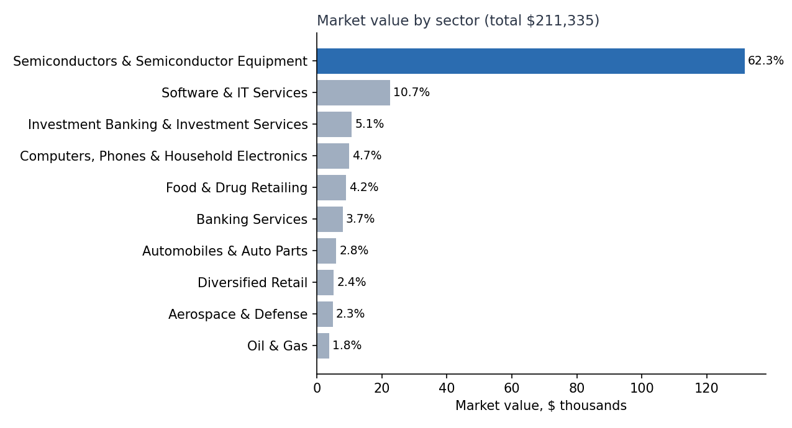
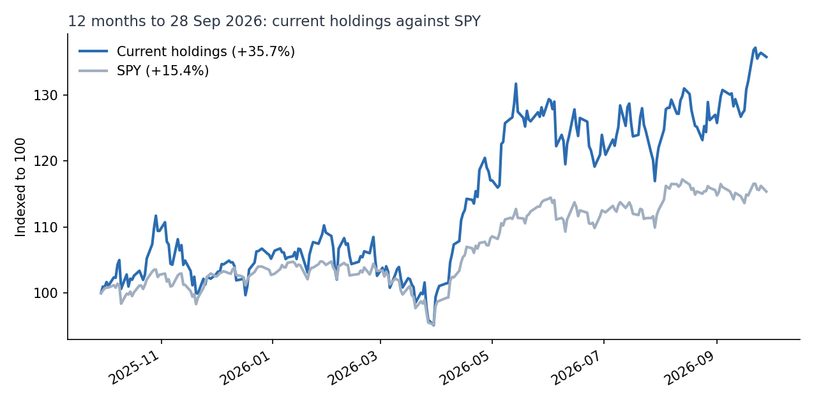

# Stock Portfolio Tracker and Risk Analytics

An Excel tracker that works out what a 16-stock portfolio has really earned and where its risk sits, with a
Python program that re-checks all 55 calculated figures. The portfolio has returned **32.2% a year** since 2019,
but **62% of its $211,335 sits in semiconductors**, so a 30% fall in that sector would cost about **$39,500**.

[](LICENSE)
[](https://www.microsoft.com/en-us/microsoft-365/excel)
[](https://github.com/alvenyuka/Stock-Portfolio-Tracker-Analytics-Engine/actions/workflows/ci.yml)


## The finding: a strong return that is mostly one bet

Headline returns from a broker statement ignore when money went in and out and say nothing about concentration.
Measured from the dated trades and a year of daily prices, the portfolio's exposure in money terms, as printed by
`validate_portfolio.py`:

| Exposure (valued 29 Sep 2026) | Amount |
|---|---:|
| 1-day loss not exceeded on 95% of days (historical VaR) | $5,645 |
| Worst peak-to-trough fall of current holdings, last 12 months | $25,279 |
| Largest holding, NVIDIA (45.1% of value) | $95,286 |
| Semiconductors (62.3% of value) | $131,600 |
| Loss if semiconductors fell 30% | **$39,480**, 18.7% of the portfolio |



With an effective number of holdings of about 4, a 30% semiconductor fall would take out nearly a fifth of the
portfolio, seven times the loss the 1-day VaR puts on an ordinary bad day. Reducing the NVIDIA position is the
lever that changes this most.

## Performance

| Measure (valued 29 Sep 2026) | Value |
|---|---:|
| Market value | $211,335 |
| Annual return since 2019, money-weighted (XIRR) | **32.2%** |
| Total gain, realised and unrealised | $183,363 |
| 12-month return vs SPY | 35.7% vs 15.4% |
| Volatility / maximum drawdown, 12 months | 26.0% / -14.8% |
| Sharpe ratio (12 months) | 1.21 |
| Beta vs SPY / tracking error | 1.64 / 16.9% |



The risk-adjusted numbers are good, but the dispersion is wide. A Sharpe ratio of 1.21 sits alongside a 14.8%
drawdown and a 16.9% tracking error, and a beta of 1.64 means the portfolio amplifies market moves, so it can
diverge sharply from SPY in either direction.

## What the review changed

An independent review of an earlier version found sales being added to positions instead of netted. The
accounting was rebuilt and every figure restated, and the validator now checks each one. Building the validator
also caught Excel's XIRR returning a silent 0% for Boeing when it failed to converge; the workbook now shows an
error instead of a false zero (Boeing has lost 13.6% a year).

## How the tracker works


```mermaid
flowchart LR
    A[Ledger: 112 dated trades] --> B[Holdings net of sales, average-cost basis]
    C[Live prices, STOCKHISTORY] --> B
    B --> D[XIRR returns, realised and unrealised P&L]
    C --> E[12-month back-cast of current holdings]
    E --> F[Volatility, drawdown, VaR, beta, tracking error]
    D --> G[Dashboard, risk analytics, money at risk]
    F --> G
    G --> H[validate_portfolio.py: 55 figures rebuilt]
```

| Input | Detail |
|---|---|
| Trade ledger | 112 trades (80 buys, 32 sells), 2019 to 2025, a paper portfolio dated 1 January each year |
| Holdings | 16 stocks across 10 sectors, valued on 29 Sep 2026 (one valuation-date input) |
| Prices | Excel's Stocks data type for current prices; `STOCKHISTORY` for 251 trading days of closes |
| Benchmark | SPY, over the same 12 months |
| Watchlist | 10 stocks with valuation and momentum screens (AMD is also a holding) |

1. **Accounting.** Units held = bought minus sold; cost basis at average purchase price; realised P&L booked on
   each sale.
2. **Returns.** XIRR over dated purchases and sales with the value on the valuation date as the final cash flow,
   per holding and for the portfolio. One input cell (`ValuationDate`) ends every IRR and price window, so the
   figures reproduce until that date is changed.
3. **Risk.** Today's holdings valued daily over 12 months give volatility, downside deviation, drawdown,
   historical VaR, and beta, tracking error and information ratio against SPY; CAPM, Sharpe, Sortino, Calmar and
   M-squared use them, and a money-at-risk block on the Risk Analytics sheet turns them into dollars.

Prices refresh with Data, Refresh All; no VBA or add-ins. RTX's London listing (2.1% of value) has no price
history and is left out of the 12-month series.


## How it is checked

The workbook carries 26 in-sheet tests, including units reconciling to the ledger. `validate_portfolio.py` then
rebuilds all 55 calculated figures from the ledger, prices and inputs, outside Excel, and its own 18 tests corrupt
the workbook one cell at a time to prove each fault is caught.

## Caveats

- **Paper portfolio.** Trades are hypothetical and dated 1 January each year (a nominal date, not a trading
  day); fees and taxes are not modelled.
- **Cost basis pools every purchase of a stock.** A running average, which the validator prints alongside,
  gives realised P&L of $15,686 rather than $14,944; total gain is the same under both.
- **Back-cast risk.** The 12-month figures value today's holdings historically, which describes current
  exposure rather than the returns actually earned over that year.
- **The sector shock is a scenario, not a forecast**, and applies one shock to the whole sector.

## Files and how to run

```bash
pip install -r requirements.txt
python validate_portfolio.py      # rebuild every figure and print the money at risk
python -m pytest                  # prove the validator catches injected faults
python make_figures.py            # redraw the README charts
```

Open `Stock Portfolio.xlsx` in Excel 365 and run Data, Refresh All for live prices.

```
Stock Portfolio.xlsx      the workbook: ledger, dashboard, analytics, risk, price history, portfolio series,
                          watchlist, validation
validate_portfolio.py     independent validator: 55 figures rebuilt, money at risk
make_figures.py           README charts drawn from the workbook's stored values
figures/                  charts and dashboard screenshots
tests/                    18 fault-injection tests for the validator
docs/METHODOLOGY.md       every definition and the review history
```

Every definition, the review that led to the rebuild and the validator's checks are in
[`docs/METHODOLOGY.md`](docs/METHODOLOGY.md).

## License

MIT. See [`LICENSE`](LICENSE).

Alven Yuka · [LinkedIn](https://www.linkedin.com/in/alven-yuka-610b78174/) · [Email](mailto:alvenyuka2@gmail.com)
