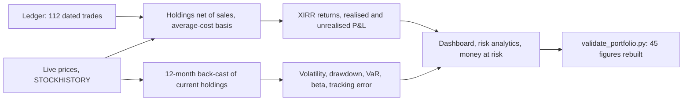
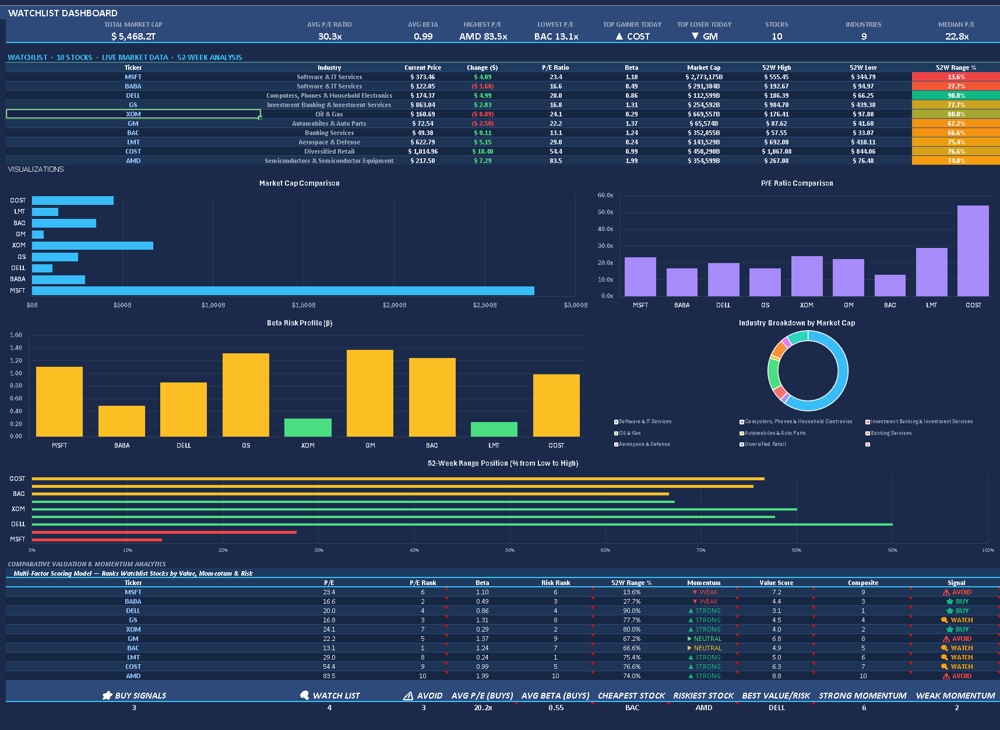

# Stock-Portfolio-Tracker-Analytics-Engine

An Excel 365 portfolio tracker for 16 listed stocks, built from a 112-trade ledger, with CAPM and 12-month risk
analytics and a Python validator that rebuilds all 45 derived figures from the raw inputs. The portfolio
returned **32.2% a year** since 2019, but **62% of its $211,335 sits in one sector**: a 30% semiconductor
sell-off would cost about **$39,500**.

[](LICENSE)
[](https://www.microsoft.com/en-us/microsoft-365/excel)
[](https://github.com/alvenyuka/Stock-Portfolio-Tracker-Analytics-Engine/actions/workflows/ci.yml)


## Contents

1. [Business problem](#business-problem)
2. [Dataset](#dataset)
3. [Methodology](#methodology)
4. [Results](#results)
5. [Business impact](#business-impact)
6. [Key insights](#key-insights)
7. [Limitations](#limitations)
8. [Repository structure](#repository-structure)
9. [How to run](#how-to-run)

## Business problem

An investor or adviser reviewing a portfolio needs to know what it has really earned, net of sales and timing,
and where its risk sits. Headline returns from a broker statement answer neither: they ignore when money went
in and out, and they say nothing about concentration or how the holdings behave in a sell-off.

This workbook derives every position, cost basis and return from dated trades, measures risk from a year of
daily prices rather than assuming it, and puts the exposure in money terms. An independent review of an
earlier version found sales being added to positions instead of netted; the accounting was rebuilt, every
figure restated, and a validator now checks each one.

## Dataset

| Input | Detail |
|---|---|
| Trade ledger | 112 dated trades (80 buys, 32 sells), 2019 to 2025, a paper portfolio |
| Holdings | 16 stocks across 10 sectors, valued on 29 Sep 2026 |
| Prices | Excel's Stocks data type for current prices; `STOCKHISTORY` for 251 trading days of closes |
| Benchmark | SPY, over the same 12 months |
| Watchlist | 10 further stocks with valuation and momentum screens |

Prices refresh with Data, Refresh All; no VBA or add-ins. RTX's London listing (2% of value) has no price
history and is left out of the 12-month series.

## Methodology


```mermaid
flowchart LR
    A[Ledger: 112 dated trades] --> B[Holdings net of sales, average-cost basis]
    C[Live prices, STOCKHISTORY] --> B
    B --> D[XIRR returns, realised and unrealised P&L]
    C --> E[12-month back-cast of current holdings]
    E --> F[Volatility, drawdown, VaR, beta, tracking error]
    D --> G[Dashboard, risk analytics, money at risk]
    F --> G
    G --> H[validate_portfolio.py: 45 figures rebuilt]
```

1. **Accounting.** Units held = bought minus sold; cost basis at average purchase price; realised P&L booked on
   each sale.
2. **Returns.** XIRR over dated purchases and sales with today's value as the final cash flow, per holding and
   for the portfolio.
3. **Risk.** Today's holdings valued daily over 12 months give volatility, downside deviation, drawdown,
   historical VaR, and beta, tracking error and information ratio against SPY; CAPM, Sharpe, Sortino and Calmar
   use them.
4. **Checks.** 26 in-sheet tests, including units reconciling to the ledger, plus the Python validator; its own
   15 tests corrupt the workbook one cell at a time to prove each fault is caught.

## Results

| Measure (valued 29 Sep 2026) | Value |
|---|---:|
| Market value | $211,335 |
| Annual return since 2019, money-weighted (XIRR) | **32.2%** |
| Total gain, realised and unrealised | $183,363 |
| 12-month return vs SPY | 35.7% vs 15.4% |
| Volatility / maximum drawdown, 12 months | 26.0% / -14.8% |
| Sharpe ratio (12 months) | 1.21 |
| Beta vs SPY / tracking error | 1.64 / 16.9% |


## Business impact

The same risk figures in money, as printed by `validate_portfolio.py`:

| Exposure | Amount |
|---|---:|
| 1-day loss not exceeded on 95% of days (historical VaR) | $5,645 |
| Worst peak-to-trough fall of current holdings, last 12 months | $25,279 |
| Largest holding, NVIDIA (45.1% of value) | $95,286 |
| Semiconductors (62.3% of value) | $131,600 |
| Loss if semiconductors fell 30% | **$39,480**, 18.7% of the portfolio |

The return is real, but it is mostly one bet. With an effective number of holdings of about 4, a 30%
semiconductor fall would take out nearly a fifth of the portfolio, seven times the loss the 1-day VaR puts on an
ordinary bad day. Reducing the NVIDIA position is the lever that changes this most.


## Key insights

- **Concentration drives both the return and the risk.** NVIDIA alone is 45.1% of value; beta against SPY is
  1.64, so the portfolio amplifies market moves.
- **The risk-adjusted numbers are good, the dispersion is wide.** A Sharpe ratio of 1.21 over 12 months sits
  alongside a 14.8% drawdown and a 16.9% tracking error, so the portfolio can diverge sharply from SPY.
- **The accounting review mattered.** Netting sales against positions restated every figure; Excel's XIRR also
  returned a silent 0% for Boeing until the validator caught the non-convergence, and the workbook now shows an
  error instead of a false zero (Boeing has lost 13.6% a year).



## Limitations

- **Paper portfolio.** Trades are hypothetical, and fees and taxes are not modelled.
- **Back-cast risk.** The 12-month figures value today's holdings historically, which describes current
  exposure rather than the returns actually earned over that year.
- **The sector shock is a scenario, not a forecast**, and applies one shock to the whole sector.

## Repository structure

```
Stock Portfolio.xlsx      the workbook: ledger, dashboard, analytics, risk, price history, portfolio series,
                          watchlist, validation
validate_portfolio.py     independent validator: 45 figures rebuilt, money at risk
make_figures.py           README charts drawn from the workbook's stored values
tests/                    15 fault-injection tests for the validator
docs/METHODOLOGY.md       every definition and the review history
```

## How to run

```bash
pip install -r requirements.txt
python validate_portfolio.py      # rebuild every figure and print the money at risk
python -m pytest                  # prove the validator catches injected faults
python make_figures.py            # redraw the README charts
```

Open `Stock Portfolio.xlsx` in Excel 365 and run Data, Refresh All for live prices.

## Documentation

Every definition, the review that led to the rebuild and the validator's checks are in
[`docs/METHODOLOGY.md`](docs/METHODOLOGY.md).

## License

MIT. See [`LICENSE`](LICENSE).

Alven Yuka · [LinkedIn](https://www.linkedin.com/in/alven-yuka-610b78174/) · [Email](mailto:alvenyuka2@gmail.com)
